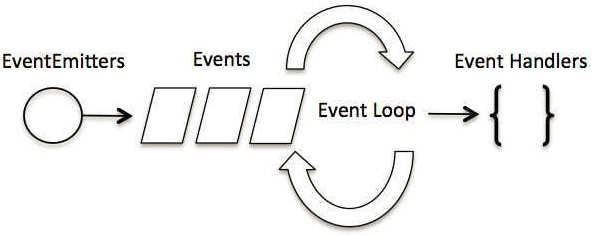

# Node.js 事件循环 #
Node.js 是单进程单线程应用程序，但是通过事件和回调支持并发，所以性能非常高。

Node.js 的每一个 API 都是异步的，并作为一个独立线程运行，使用异步函数调用，并处理并发。

Node.js 基本上所有的事件机制都是用设计模式中观察者模式实现。

Node.js 单线程类似进入一个while(true)的事件循环，直到没有事件观察者退出，每个异步事件都生成一个事件观察者，如果有事件发生就调用该回调函数.

## 事件驱动程序 ##
Node.js 使用事件驱动模型，当web server接收到请求，就把它关闭然后进行处理，然后去服务下一个web请求。

当这个请求完成，它被放回处理队列，当到达队列开头，这个结果被返回给用户。

这个模型非常高效可扩展性非常强，因为webserver一直接受请求而不等待任何读写操作。（这也被称之为非阻塞式IO或者事件驱动IO）
在事件驱动模型中，会生成一个主循环来监听事件，当检测到事件时触发回调函数。

整个事件驱动的流程就是这么实现的，非常简洁。有点类似于观察者模式，事件相当于一个主题(Subject)，而所有注册到这个事件上的处理函数相当于观察者(Observer)。

Node.js 有多个内置的事件，我们可以通过引入 events 模块，并通过实例化 EventEmitter 类来绑定和监听事件，如下实例：

    // 引入 events 模块
    var events = require('events');
    // 创建 eventEmitter 对象
    var eventEmitter = new events.EventEmitter();
    
以下程序绑定事件处理程序：

	// 绑定事件及事件的处理程序
	eventEmitter.on('eventName', eventHandler);

我们可以通过程序触发事件：

	// 触发事件
	eventEmitter.emit('eventName');